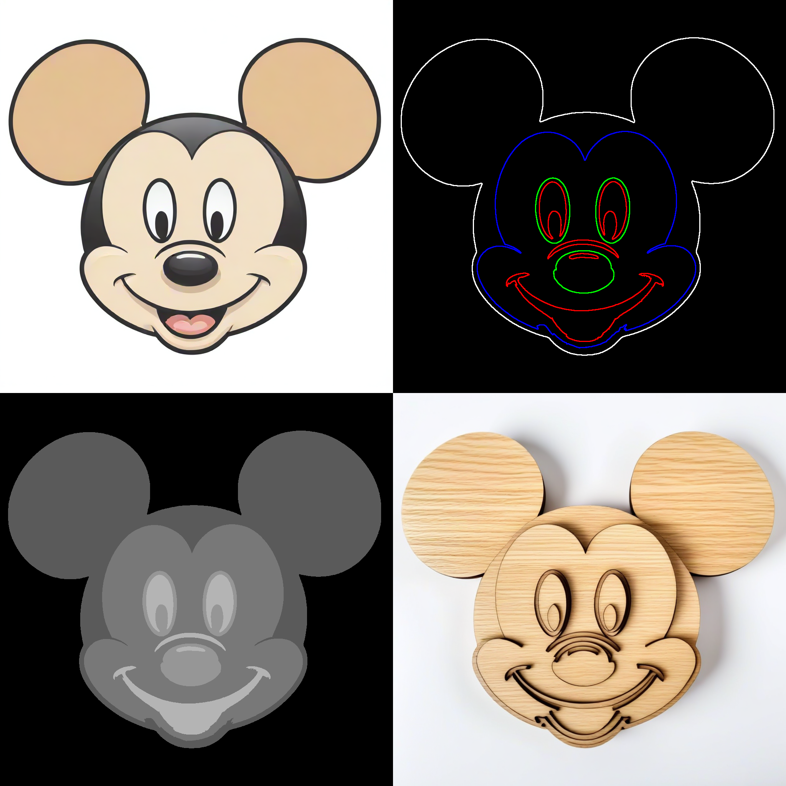
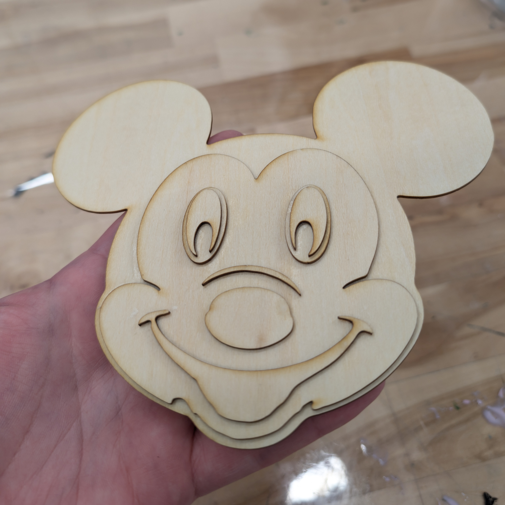
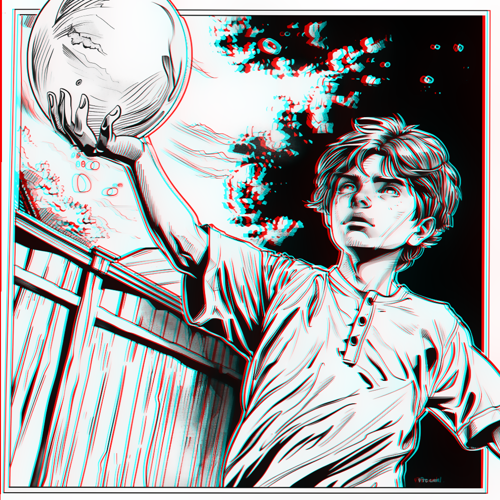
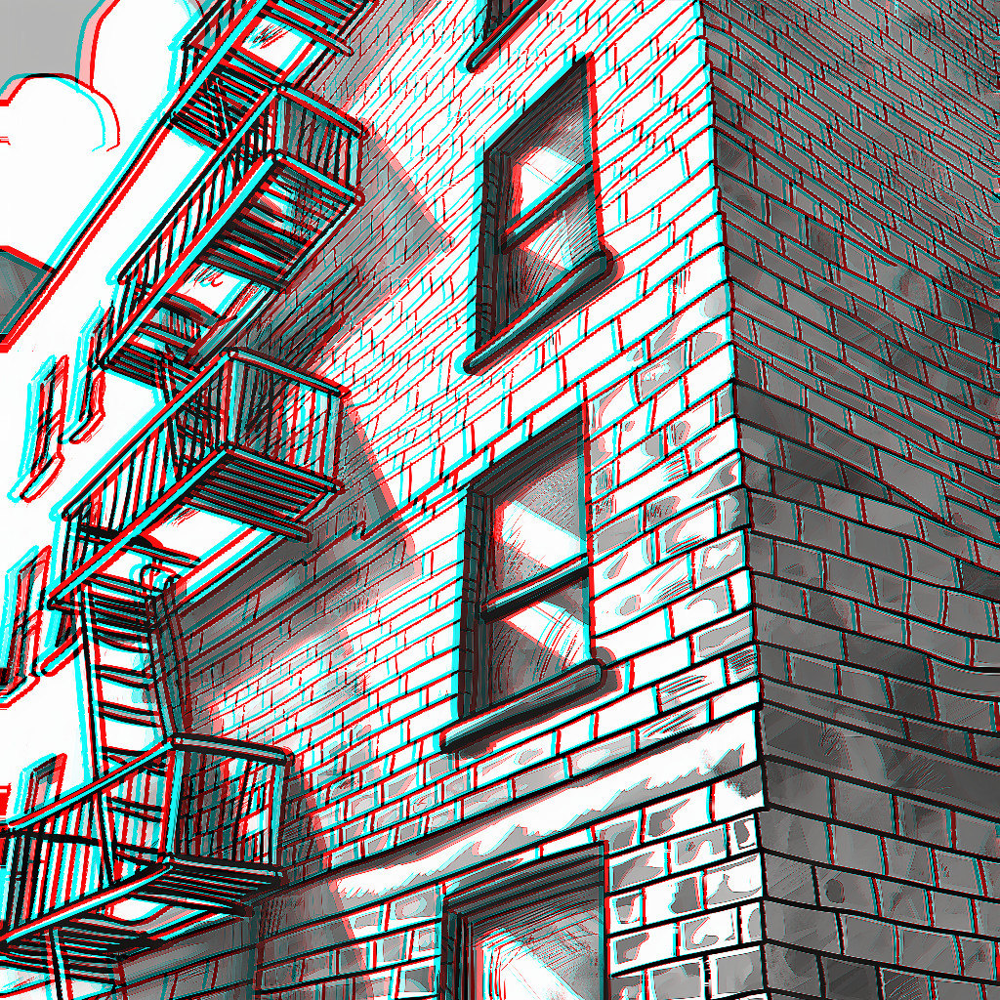
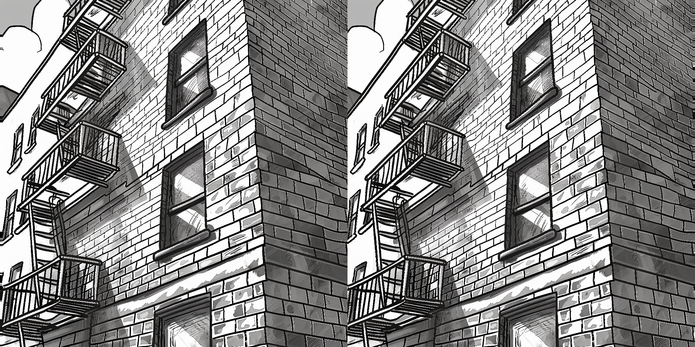
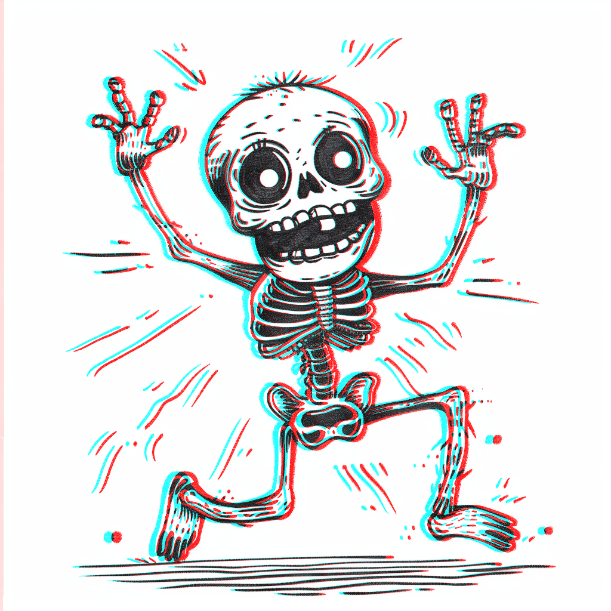
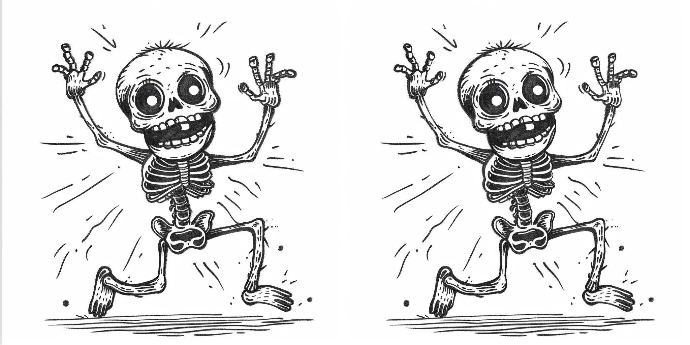

# FishTools

## LaserCutterFull

***

### Description

The `LaserCutterFull` node processes an outline image, a depth map, and a base layer image to generate multiple layers for laser cutting. It assigns each layer based on the intensity values from the depth map and creates an SVG output combining all layers.




### Inputs

- `outlines`: The outline image (in grayscale). This should be simple line art.
- `depthmap`: The depth map image (in grayscale). Use depth-to-anything with a mask to filter out background noise.
- `base_layer`: The base layer image (in grayscale). This is the bottom of the laser cutter art. Use the mask from depth-to-anything.
- `num_divisions`: The number of layers to divide the depth map into.
- `use_approximation`: Boolean to toggle the use of contour approximation.
- `approximation_epsilon`: Epsilon value for the contour approximation.
- `shape_similarity_threshold`: Threshold for filtering nearly identical shapes.
- `min_shape_area`: Minimum area for a shape to be considered.
- `apply_blur`: Boolean to apply Gaussian blur to the depth map.
- `corner_threshold`: Threshold for corner detection in the SVG conversion.
- `length_threshold`: Threshold for path length in the SVG conversion.
- `max_iterations`: Maximum number of iterations for the SVG conversion.
- `splice_threshold`: Threshold for splicing paths in the SVG conversion.
- `path_precision`: Precision for path coordinates in the SVG output.

### Outputs

- `layer0` to `layer5`: The six layers generated for laser cutting.
- `base_layer`: The base layer image.
- `combined_svg`: The combined SVG string of all layers. *Note* You will need to save this file with a .svg extension. In the example workflow, this is done with a simple Save Text node.
- `debug_info`: Debug information string.

### Variables

- `num_divisions`: Integer specifying the number of depth layers to generate. Minimum is 2, maximum is 6, default is 6.
- `use_approximation`: Boolean to enable or disable the use of contour approximation.
- `approximation_epsilon`: Float specifying the epsilon value for contour approximation. Default is 0.01, range is 0.001 to 1.0.
- `shape_similarity_threshold`: Float specifying the threshold for filtering nearly identical shapes. Default is 0.01, range is 0.0 to 1.0.
- `min_shape_area`: Float specifying the minimum area for a shape to be considered. Default is 250.0, range is 0.0 to 1000.0.
- `apply_blur`: Boolean to apply Gaussian blur to the depth map. Default is False.
- `corner_threshold`: Integer for corner detection in SVG conversion. Default is 60, range is 0 to 100.
- `length_threshold`: Float for path length threshold in SVG conversion. Default is 4.0, range is 0.0 to 10.0.
- `max_iterations`: Integer for maximum iterations in SVG conversion. Default is 10, range is 1 to 20.
- `splice_threshold`: Integer for splicing paths in SVG conversion. Default is 45, range is 1 to 100.
- `path_precision`: Integer for precision of path coordinates in SVG. Default is 3, range is 1 to 10.

### Implementation Details

1. The node preprocesses input images and extracts contours from the outline and base layer images.
2. It calculates intensities for each shape based on the depth map.
3. Shapes are assigned to different layers based on their intensities.
4. The node generates an SVG for each layer and combines them into a single SVG file.
5. The output includes separate image layers, a combined SVG, and debug information.

### Usage Tips

- Ensure your input images (outlines, depth map, and base layer) are properly prepared and aligned.
- Experiment with the `num_divisions` parameter to achieve the desired level of depth separation.
- Adjust `min_shape_area` to filter out small, unwanted shapes.
- Use the `apply_blur` option if the depth map contains noise that affects layer assignment.
- Fine-tune SVG conversion parameters (`corner_threshold`, `length_threshold`, etc.) for optimal vector output.

### Note on SVG Output

The combined SVG output includes all layers and the base layer. Each layer is grouped with a unique ID for easy manipulation in vector graphics software. Remember to save the SVG output with a .svg extension using a Save Text node or similar method in your workflow.

***
## AnaglyphCreator

### Description

The `AnaglyphCreator` node generates anaglyph 3D images from a 2D image and its corresponding depth map. It creates a stereoscopic effect by shifting the color channels based on the depth information, resulting in an image that appears three-dimensional when viewed with red-cyan 3D glasses.



### Inputs

- `image`: The original 2D image (in color or grayscale).
- `depthmap`: The depth map image (in grayscale). This represents the relative depth of each pixel in the original image.
- `anaglyph_shift`: A float value determining the intensity of the 3D effect.

### Outputs

- `anaglyph_image`: The final anaglyph 3D image.
- `visualization_image`: A visualization of the pixel shifts applied to create the anaglyph effect for debugging purposes.
- `overlap_mask`: An image showing the overlap between the left and right eye views for debugging purposes.
- `left_debug_image`: The left eye view (cyan channels) for debugging purposes.
- `right_debug_image`: The right eye view (red channel) for debugging purposes.

### Variables

- `anaglyph_shift`: Float specifying the intensity of the 3D effect. Minimum is 0.0, maximum is 20.0, default is 5.0, with a step of 0.1.

### Tips for Best Results

1. Use high-contrast images with clear edges for the best 3D effect.
2. Experiment with the `anaglyph_shift` value to find the right balance between 3D depth and viewing comfort.
3. Ensure your depth map accurately represents the relative depths in your image for the most realistic 3D effect.
4. For color images, be aware that some color information may be lost due to the nature of anaglyph 3D creation.

### Known Limitations

1. Color images may appear slightly blurry in the final anaglyph. This is a known issue that may be addressed in future updates.
2. Very large shift values may cause noticeable artifacts, especially around the edges of the image.

## AnaglyphCreatorPro

### Description

The `AnaglyphCreatorPro` node is an advanced version of the AnaglyphCreator, offering more control and flexibility in creating stereoscopic 3D images. It generates anaglyph 3D images, side-by-side stereo pairs, or top-bottom stereo pairs from a 2D image and its corresponding depth map. This node provides various parameters to fine-tune the 3D effect and offers different fill techniques for handling occlusions.







### Inputs

- `image`: The original 2D image (in color).
- `depthmap`: The depth map image (in grayscale). This represents the relative depth of each pixel in the original image.
- `divergence`: A float value determining the intensity of the 3D effect.
- `separation`: A float value controlling the horizontal separation between left and right views.
- `stereo_balance`: A float value balancing the stereo effect between left and right views.
- `stereo_offset_exponent`: A float value controlling the non-linearity of the stereo offset.
- `fill_technique`: The method used to fill occluded areas ("naive", "naive_interpolating", "polylines_soft", "polylines_sharp").
- `output_mode`: The type of output to generate ("red-cyan-anaglyph", "left-right", "top-bottom").

### Outputs

- `IMAGE`: The final stereoscopic image based on the selected output mode.

### Variables

- `divergence`: Float specifying the intensity of the 3D effect. Range: 0.0 to 20.0, default: 5.0, step: 0.1.
- `separation`: Float controlling the horizontal separation. Range: -10.0 to 10.0, default: 0.0, step: 0.1.
- `stereo_balance`: Float balancing left and right views. Range: -1.0 to 1.0, default: 0.0, step: 0.1.
- `stereo_offset_exponent`: Float for non-linear stereo offset. Range: 0.1 to 5.0, default: 1.0, step: 0.1.
- `fill_technique`: String selecting the occlusion fill method. Options: "naive", "naive_interpolating", "polylines_soft", "polylines_sharp".
- `output_mode`: String selecting the output type. Options: "red-cyan-anaglyph", "left-right", "top-bottom".

### Tips for Best Results

1. Experiment with `divergence` and `separation` to find the right balance between 3D depth and viewing comfort.
2. Use `stereo_balance` to adjust the relative shift between left and right views.
3. Adjust `stereo_offset_exponent` to control the non-linearity of the depth effect.
4. Try different `fill_technique` options to handle occlusions effectively, especially for images with large depth variations.
5. Choose the appropriate `output_mode` based on your intended viewing method (anaglyph glasses or stereo displays).

### Known Limitations

1. Very large divergence or separation values may cause noticeable artifacts, especially around the edges of the image.
2. The effectiveness of different fill techniques may vary depending on the image content and depth map quality.

## Deptherize

### **NOTE**: 

The current version of LaserCutterFull does not work with Deptherize (which is really only for making a fake preview anyway)

### Description

The `Deptherize` node converts SVG data into a depth map image. Each layer in the SVG data is assigned a grayscale value to represent depth.

### Inputs

- `svg_data`: The SVG data as a string.

### Outputs

- `depth`: The generated depth map image.
- `debug_info`: Debug information string.

### Variables

- `svg_data`: String containing the SVG data.

## Installation

To install the required packages, run:

```bash
pip install -r requirements.txt
```

## Requirements

The required packages are listed in the `requirements.txt` file:

```
torch
numpy
opencv-python-headless
svgwrite
scikit-image
svgtools
vtracer
svgpathtools
```

## License

This project is licensed under the MIT License.

## Contributing

Contributions are welcome! Please open an issue or submit a pull request for any improvements or bug fixes.
